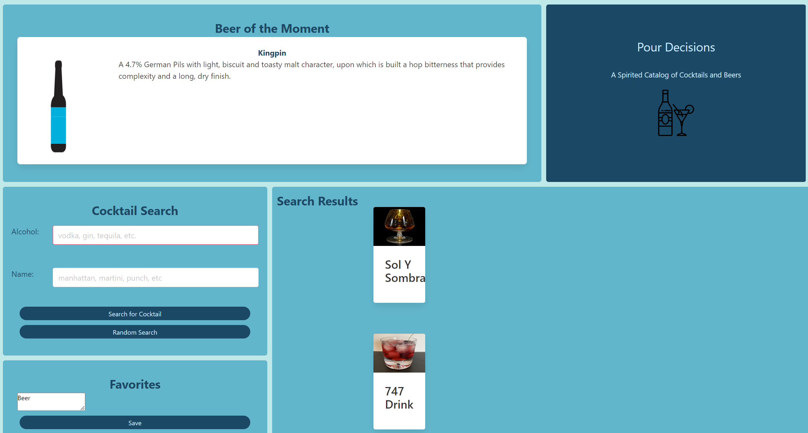

## Pour Decisons
https://kateredkina.github.io/recipe-catalog/

## Description
The purpose of this site is to help users find new beers and to search up a cocktail recipe that could suit their needs!

## Usage
Upon the page loading, the user will be able to view the "Beer of the Moment". Upon the refreshing of the page, they would be able to get a new beer. The section displays the name of the beer, a description, and an image of the bottle if available.
The user can then scroll down to discover new cocktails! They can choose to search by the alcohol or name, and see the results OR they can select "Random Cocktail" and receive two results. From there, but selecting the cocktail name, they'll be able to see the cocktail recipe.
If the user sees a cocktail they like best, then they can press the + button and add it to their Favorites, which will be saved, even if they leave the page and come back later.

### PourDecisions page

## To learn more! See our Presentation
https://docs.google.com/presentation/d/1nFKB-ZL5tT1wc7Nqxc5PLxGtjTem3OKlTNqWB8Pjcfk/edit?usp=sharing

## Credits
Please see the following sites that were used to assist in our project:
### Bulma Help Basic Documenation
https://bulma.io/documentation/overview/ https://stackoverflow.com/questions/49889805/bulma-content-going-outside-of-box
### Punk API
https://symfony.com/doc/current/reference/forms/types/choice.html#overridden-options
### CocktailDB API
https://www.thecocktaildb.com/api.php